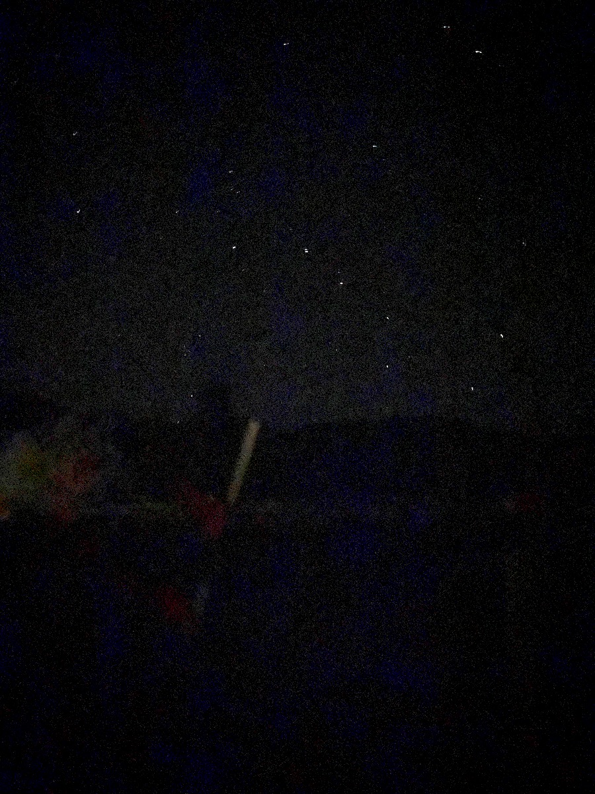
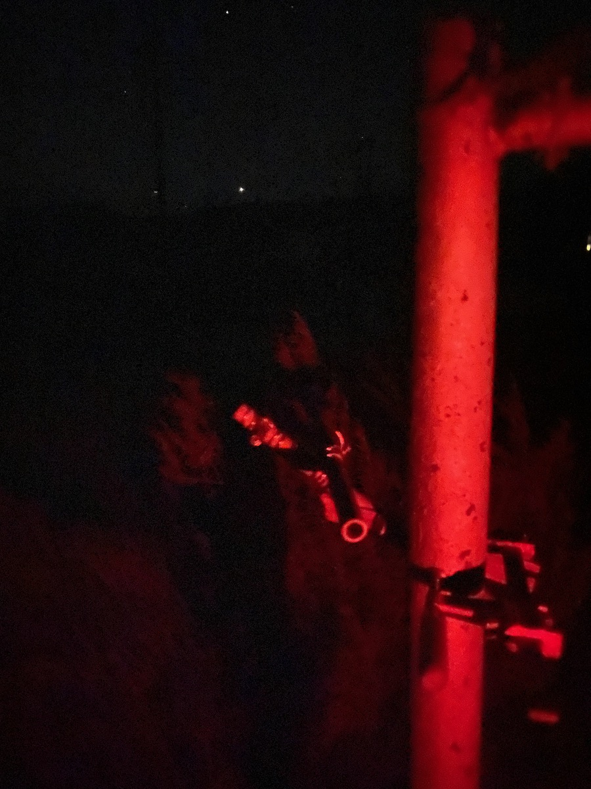
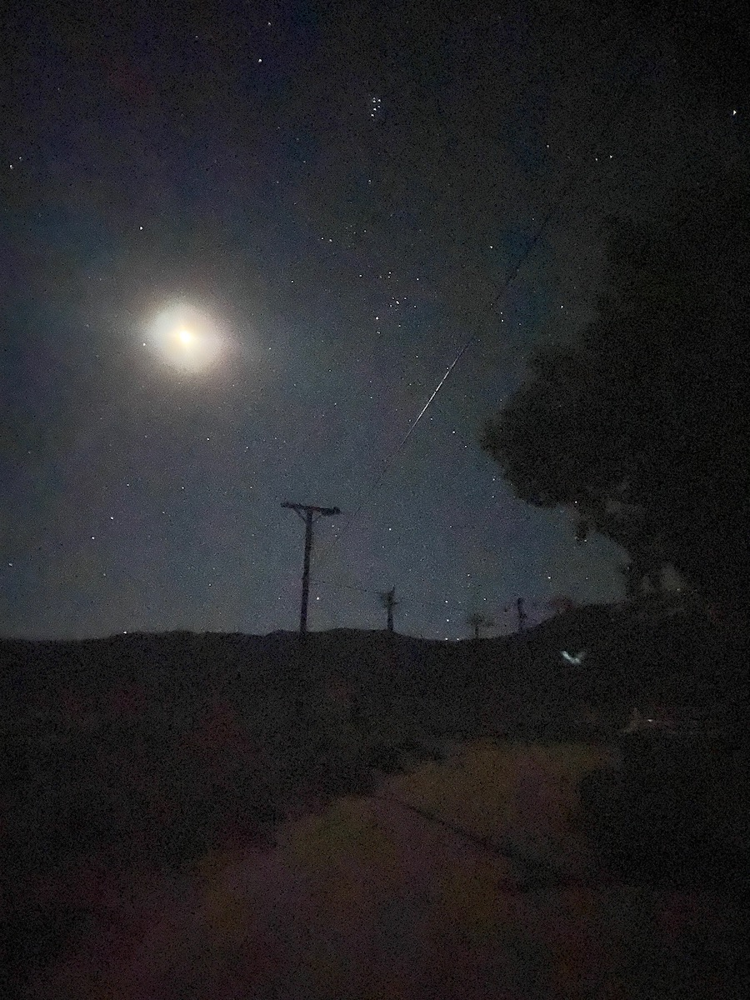
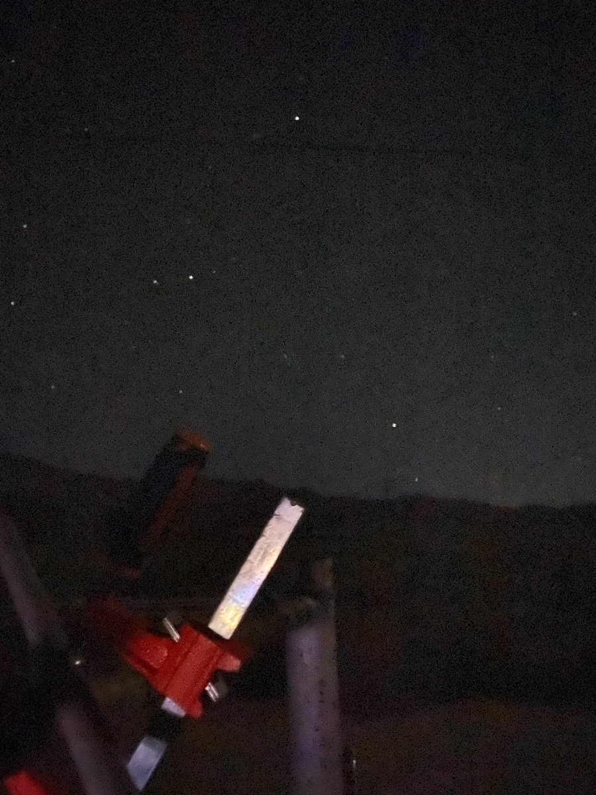

Presentation Notes - 2023-09-07
===============================

Hexi: N-S motion of the Sun
---------------------------

Equator, Celestial Equator, Celestial sphere.

(1) Point A, Sun on the Ecliptic, Spring Equinox or vernal Equinox, N-D - 12 hours, March 21
(2) Point B, Sun at most northern point, 23.5º north of the equator, Summer solstice, longest day in northern hemisphere, usually on June 22
(3) Point A', on other side of celestial equator, fall, autumn, or autumnal equinox, usually on Sept. 23
(4) Point B', Sun at most suouther point, 23.5º south of the equator, Winter solstice, shortest day in northern hemisphere, usually on Dec. 22

We had some discussion of why these four points aren't each separated by an equal 365.24/4 - 91.31 days. Both
Ptolemy and Kepler have explanations. We should wait on this and pretend the separation is equal.

Walker: Mountains on the Earth
------------------------------

Earth is 24,900 miles in circumference
Highest point, 29,031 feet high
Deepest point, 35,876 feet below

Scale Earth to five feet around:

Earth is 131,472,000 feet around

Therefore, scale down by 26,294,400

Earth is 1.6 feet across and the highest to lowest difference becomes 1/32"

Repeat calculation for Mars. Still only around 1/10".

Mac (presentation 2): Constellations of the Southern Hemisphere and the Incas
-----------------------------------------------------------------------------

Two Dutch guys on a ship around Indonesia added a bunch of constellations.
Later a Frenchman added more.

See star chart handed out for southern hemisphere. Some constellations that we say are in the south, they can see along their northern horizon.

Incas named the dark patches in the Milky Way! See handout.

Clara: Phases of The Moon
-------------------------

Moon phases named. Moon phases explained. Rises about 50 minutes further behind the Sun each day. Combine that with 29 days in a lunar cycle to get 1450 minutes. If you do it exactly you see that a complete lunar cycle is achieved every 29.53 days. The Moon has done one less full rising and setting than the Sun in that time.

Also some discussion of eclipses and libation.

Rania
-----

Lovely drawings of the sky when facing the direction of Henderson of sky at 9pm and 5am. It is dramatically different.

Demonstration of use of dioptra (pointed at Mizar) and compound dioptra (pointed at Polaris and Jupiter).

Dioptra pointed at Mizar

Compound dioptra with primary tube pointed at Polaris and secondary tube pointed at Jupiter rising in the east

The same region of sky as Jupiter was in &mdash; now the Moon, the Hyades, and the Pleiades dominate the eastern sky and Jupiter has gone out of frame to the SE

Four hours after the dioptra was set up, Mizar and the whole Big Dipper handle are below the horizon. The Pointer stars of the Big Dipper are just coming up. They point to Polaris which hasn't moved.

