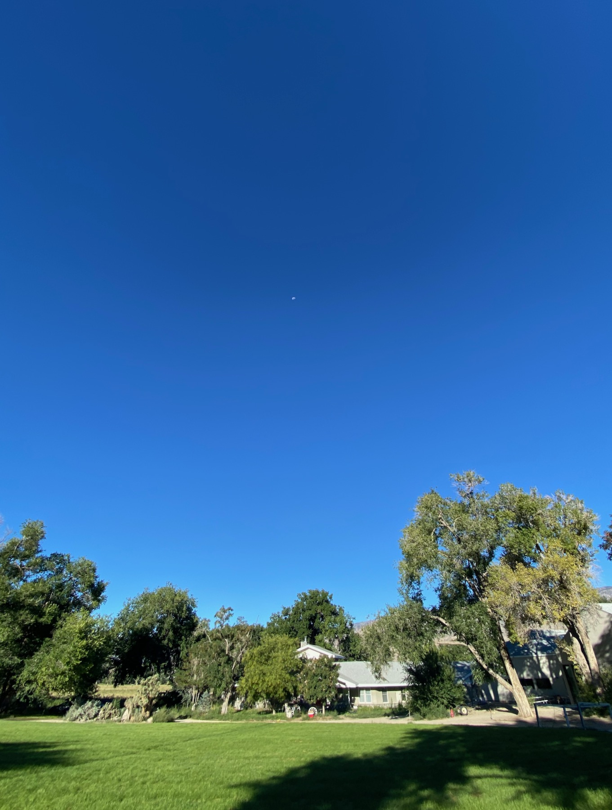

## Ancient Astronomy &mdash; Daily Schedule Term 2

Course [home page](./)

### Week 1 &mdash; The Historical context, 1700 BC&ndash;1543 AD

* Preparation for Thursday, Aug. 31 &mdash; Read Preface and Sections 1.1 to 1.3 of Evans &mdash; Choose any topic from the reading to go into more detail on in a presentation to the class &mdash; Come armed with strong opinions on what we should assign for the next class and the first homework
* Thursday, Aug. 31 &mdash; Presentations: Mac, history of sexagesimal system; Hexi, conversion of Babylonian digits to decimal; Rania, water clocks and Torricelli's Law; Walker, Ptolemy's model of the cosmos in his Mathematike Syntaxis; Brian, [constellations and star risings in 1000 B.C.](./resources/1000BCConstellations.pdf) &mdash; The consistency of the nineteen-year cycle containing seven leap-years (see bottom of p. 16) with modern values for the solar year (365.24 days, technically the tropical year) and the lunar month (29.53 days, also known as the synodic month) &mdash; Modern leap-year accounting

### Week 2 &mdash; Start Diurnal, Synodic, and Annual Motion

* Preparation for Monday, Sept. 4 &mdash; Continue in Evans to p. 44 &mdash; Turn in as homework and prepare to present the activities described in Evans Sections 1.3 and 1.5 &mdash; Look ahead in Evans to develop an opinion on what we should cover and present (assigning ourselves supplementary reading is possible!) for the next class
* Monday, Sept. 4 &mdash; Gnomon presentations and a sample [Gnomon Report](./assignments/GnomonReport.pdf) &mdash; Closer examination of figures 1.17 to 1.20 using the [Spherical Concepts](https://www.omniterrum.com/product-category/sold/sold-globe-novelties/cw215art88) celestial sphere &mdash; 366.24 revolutions of the stars per year vs. 365.24 days in a year &mdash; Pixzul's [Zodiacal Motion Animation](./resources/ZodiacalMotionAnimation.mp4)
* Preparation for Thursday, Sept. 7 &mdash; Continue in Evans to p. 58 &mdash; Prepare *two* presentations to share (about five minutes for each presentation) relating in any significant way to the material on pp. 39-58 &mdash; As one project, consider doing something with the [Pardies Celestial Cube from David Rumsey](./resources/StarChartsAndGlobes/PardiesCelestialCubeFromDavidRumsey.jpg) that everyone got an 11&ldquo;x17&rdquo; photocopy of &mdash; Here is additional source material for the more artistic among you relating to [Star Charts and Globes](./resources/StarChartsAndGlobes/index.html)
* Thursday, Sept. 7 &mdash; [Presentations relating to the material on pp. 39-58](./assignments/presentation_notes-2023-09-07.md)

### Week 3 Finish Diurnal, Synodic, and Annual Motion

* Preparation for Monday, Sept. 11 &mdash; Continue in Evans to end of Chapter 1, p. 74 &mdash; Please add one more 5-minute presentation on any topic of your choice relating to the remainder of Chapter 1 &mdash; Presentation by Hexi: [Using your hand for estimating angles](./resources/AngularEstimationUsingYourHand.png)
* Preparation for Thursday, Sept. 14 &mdash; ASSIGNMENT DELAYED TO THURSDAY DUE TO WEEKEND RAIN AND CLOUDS: Turn in as homework the exercise described in Evans Section 1.18, pp. 73-74 (this is a many-part problem, so budget lots of time to complete it, but you can just use 1/2&deg; for the angular diameter of the Moon rather than attempting to measure it) &mdash; Also turn in as homework two drawings showing the diurnal motion of the night sky *&agrave; la* Rania's (*e.g.,* two drawings of a substantial region of the night sky at least two hours apart) &mdash; Thursday presentations: Clara, the Transit of Venus of 1769 (answers the question, how did humans finally learn the distance to the Sun); Rania, the calculations of Aristarchus; Mac, the calculations of Eratosthenes; Walker, Changes in the motion of the sun over millenia &mdash; Reading for Thursday, photocopy Chapter 2 of Evans if your copy hasn't arrived, and read through Section 2.4, p. 91
* More to consider for upcoming assignments: We could do additional constellation or star projects &mdash; As one specific idea, we could locate and memorize the [15 Brightest Stars](./resources/15BrightestStars-September.pdf) visible at our latitude, starting with the 6 that are easy to locate in the evening in September &mdash; As another idea, we could locate and memorize the ecliptic constellations shown in Evans Figure 1.35, p. 55 &mdash; A new lunar cycle begins on Thursday Sept. 14, so in the week or so *after* Sept. 14, we can do the observation described in Evans Section 1.11, p. 58 &mdash; Hexi has located a well-regarded translation of *The Almagest* and we could consider reading selections from it in addition to progressing into Chapter 2 of Evans

Waning gibbous Moon (about to become third quarter), very high in the eastern sky on Tuesday morning, Sept. 5 &mdash; Is it fair to describe it as being &ldquo;ahead&rdquo; of the Sun? (Why?) &mdash; If you saw it in the east after sunset (which you will starting around Saturday, Sept. 16) would it then be fair to say it had fallen behind the Sun?

