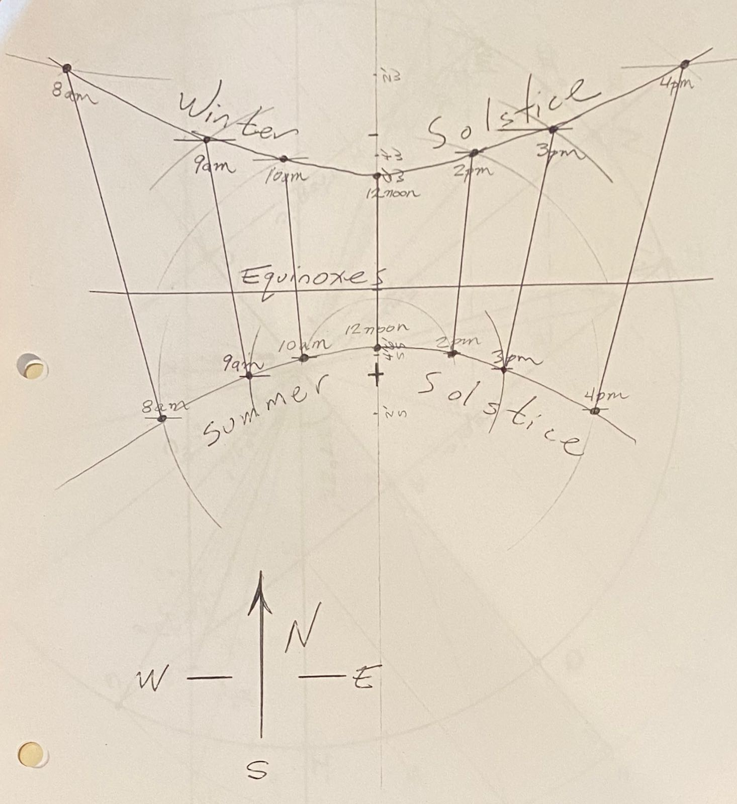

## Ancient Astronomy &mdash; Daily Schedule Term 2

Course [home page](./)

See also: [Daily Schedule Term 3](./daily_schedule-term_3.html)

### Week 1 &mdash; The Historical context, 1700 BC&ndash;1543 AD

* Preparation for Thursday, Aug. 31 &mdash; Read Preface and Sections 1.1 to 1.3 of Evans &mdash; Choose any topic from the reading to go into more detail on in a presentation to the class &mdash; Come armed with strong opinions on what we should assign for the next class and the first homework
* Thursday, Aug. 31 &mdash; Presentations: Mac, history of sexagesimal system; Hexi, conversion of Babylonian digits to decimal; Rania, water clocks and Torricelli's Law; Walker, Ptolemy's model of the cosmos in his Mathematike Syntaxis; Brian, [constellations and star risings in 1000 B.C.](./resources/1000BCConstellations.pdf) &mdash; The consistency of the nineteen-year cycle containing seven leap-years (see bottom of p. 16) with modern values for the solar year (365.24 days, technically the tropical year) and the lunar month (29.53 days, also known as the synodic month) &mdash; Modern leap-year accounting

### Week 2 &mdash; Start Diurnal, Synodic, and Annual Motion

* Preparation for Monday, Sept. 4 &mdash; Continue in Evans to p. 44 &mdash; Turn in as homework and prepare to present the activities described in Evans Sections 1.3 and 1.5 &mdash; Look ahead in Evans to develop an opinion on what we should cover and present (assigning ourselves supplementary reading is possible!) for the next class
* Monday, Sept. 4 &mdash; Gnomon presentations and a sample [Gnomon Report](./assignments/GnomonReport.pdf) &mdash; Closer examination of figures 1.17 to 1.20 using the [Spherical Concepts](https://www.omniterrum.com/product-category/sold/sold-globe-novelties/cw215art88) celestial sphere &mdash; 366.24 revolutions of the stars per year vs. 365.24 days in a year &mdash; Pixzul's [Zodiacal Motion Animation](./resources/ZodiacalMotionAnimation.mp4)
* Preparation for Thursday, Sept. 7 &mdash; Continue in Evans to p. 58 &mdash; Prepare *two* presentations to share (about five minutes for each presentation) relating in any significant way to the material on pp. 39-58 &mdash; As one project, consider doing something with the [Pardies Celestial Cube from David Rumsey](./resources/StarChartsAndGlobes/PardiesCelestialCubeFromDavidRumsey.jpg) that everyone got an 11&ldquo;x17&rdquo; photocopy of &mdash; Here is additional source material for the more artistic among you relating to [Star Charts and Globes](./resources/StarChartsAndGlobes/index.html)
* Thursday, Sept. 7 &mdash; [Presentations relating to the material on pp. 39-58](./assignments/dioptra/presentation_notes-2023-09-07.md)

### Week 3 &mdash; Finish Diurnal, Synodic, and Annual Motion

* Preparation for Monday, Sept. 11 &mdash; Continue in Evans to end of Chapter 1, p. 74 &mdash; Please add one more 5-minute presentation on any topic of your choice relating to the remainder of Chapter 1 &mdash; Turn in as Assignment 2 the exercise described in Evans Section 1.18, pp. 73-74 (this is a many-part problem, so budget lots of time to complete it, but you can just use 1/2&deg; for the angular diameter of the Moon rather than attempting to measure it, and [here is the picture](./assignments/1981LunarEclipseBrianPopp.png) he refers to) &mdash; Also turn in as Assignment 2 two drawings showing the diurnal motion of the night sky *&agrave; la* Rania's (*e.g.,* two drawings of a substantial region of the night sky at least two hours apart)
* Monday, Sept. 11 &mdash; Handed out [15 Brightest Stars](./resources/15BrightestStars-September.pdf) visible at our latitude, with notations on the 6 that are easy to locate in the evening in September &mdash; Presentation by Hexi: [Using your hand for estimating angles](./resources/AngularEstimationUsingYourHand.png)
* Preparation for Thursday, Sept. 14 &mdash; Reading for Thursday, photocopy Chapter 2 of Evans if your copy hasn't arrived, and read through Section 2.4, p. 91 &mdash; Presentations coming from Rania, Clara, Mac, and Walker
* Thursday, Sept. 14 &mdash; Thursday presentations: Clara, the Transit of Venus of 1769 (answers the question, how did humans finally learn the distance to the Sun!); Rania, the calculations of Aristarchus; Mac, the calculations of Eratosthenes; Walker, Changes in the declination of the sun over millenia &mdash; [Eratosthenes - Size of Earth](./resources/EratosthenesSizeOfEarth.pdf) calculation distributed &mdash; [Aristarchus - Size of Moon](./resources/AristarchusSizeOfMoon.pdf) calculation distributed

### Week 4 &mdash; Geometry on the Celestial Sphere

* To contemplate as you prepare for the upcoming moon plotting assignment (Assignment 4): [Waning gibbous moon high in the *western* morning sky on Tuesday, Sept. 5](./resources/MorningMoonSept5.jpeg) &mdash; Is it fair to describe it as being &ldquo;ahead&rdquo; of the Sun? (Why?) &mdash; If you saw it in the west after sunset (which you will starting soon) would it then be fair to say it had fallen *behind* the Sun? &mdash; What does it even mean to be &ldquo;ahead&rdquo; or &ldquo;behind&rdquo; something that passes by daily? &mdash; If you are behind, aren't you just ahead of the next day's occurrence?
* Preparation for Monday, Sept. 18 &mdash; As Assignment 3, complete the [Charting the Zodiac kit](./assignments/zodiac_chart/index.html) &mdash; Since Saturday, Sept. 17 you have been plotting the motion of the waxing crescent Moon and will continue taking position data and plotting it on the [Moon Plotting Chart](./assignments/moon_plotting/MoonPlottingChart.pdf) through Thursday, Sept. 21 (see especially Evans Section 1.11, p. 58) &mdash; The reading for Monday is through Evans Section 2.10 p. 105 &mdash; Come visit me at the West Duplex if you want to use my Starship Earth celestial sphere to do parts of Exercise 2.10 on p. 105 &mdash; The geometry is now getting challenging!
* Monday, Sept. 18 &mdash; [Tycho Brahe at Uraniborg mural](./resources/Tycho-Brahe-Mural-Quadrant.jpg) which makes it very clear how altitude and right ascension were measured at his observatory &mdash; A [Systematic introduction to the L&eacute;n&aacute;rt Sphere](/heavenly-mathematics/resources/L&eacute;n&aacute;rt_sphere/L&eacute;n&aacute;rt_sphere.html) for performing celestial sphere calculations by drawing and measuring angles
* Preparation for Thursday, Sept. 21 &mdash; Continue making Moon observations on the evenings of Sept. 18, 19, 20, and 21 &mdash; The time of observation is much less critical now because there is longer between sunset and moonset &mdash; 7:45pm or somewhat later is best for the Moon observations because it is dark enough after 7:45pm to make out many stars &mdash; Put completed [Moon plotting charts](./assignments/moon_plotting/MoonPlottingChart.pdf) in my mailbox on Friday, Sept. 22 &mdash; Come by my home office to use my Starship Earth celestial sphere to do exercises like those in Evans Section 2.6 and 2.7 &mdash; Continue in Evans through Section 2.13, p. 120 &mdash; I wanted to produce exercises that will cause you to learn to use the formulae  on p. 105, but I haven't and so it will become part of Monday's assignment &mdash; You should get started though by doing Evans Exercise 2.10, Part 1
* Thursday, Sept. 21 &mdash; How much weaker is gravity at the Equator? &mdash; The difference between weight and mass

### Week 5 &mdash; Ascensions &mdash; Sundials

* Preparation for Monday, Sept. 25 &mdash; As Assignment 5, complete [Ascension and Spherical Trigonometry](./assignments/AscensionsAndSphericalTrigonometryAssignment.pdf) &mdash; Finish reading Chapter 2 of Evans &mdash; Choose a calculation from Chapter 2 that you believe is interesting and instructive and prepare to present it
* Preparation for Thursday, Sept. 28 &mdash; Clara and Mac are building and demonstrating [a sundial](./resources/SundialForDeepSprings.pdf) &mdash; Hexi presented the relationship between latitude and the length of the shortest (or longest) night on the summer (or winter) solstice &mdash; The reading is to end of Evans Section 3.4, p. 141
* Brian's Lightning [Trig Refresher](./resources/TrigRefresher.pdf) (should help with the geometry we have been doing a lot of lately)

### Week 6 &mdash; Calendrical Systems &mdash; Julian Date

* I have prepared star charts for plotting [the position of Jupiter](./assignments/jupiter_plotting/JupiterPlottingChart.pdf) and [the position of Venus](./assignments/venus_plotting/VenusPlottingChart.pdf) from Sept. 29 to Oct. 29 &mdash; If you do ten observations about three days apart (more when it is clear to make up for days that you have to miss due to clouds or other problematic conditions), you will have good results that we can review on Monday, Oct. 30th &mdash; We could turn in the work then or we could continue making observations for another two weeks
* Preparation for Monday, Oct. 2 &mdash; Skip the rest of Chapter 3 (on medieval astrolabes) and read Evans Chapter 4 through Section 4.6 (pp. 163-182) &mdash; As Assignment 6 for Monday, do Evans Exercises 4.2 and 4.4
* Monday, Oct. 2 &mdash; Calendrical Calculations &mdash; [Midterm Exam Outline](./exams/Term2ExamOutline.pdf)
* Preparation for Thursday, Oct. 5 &mdash; Read the rest of Chapter 4, pp. 182-204 &mdash; Choose an example or exercise from Chapter 4 to present in 5-10 minutes (informally coordinate with other class members so everyone isn't doing the same thing) &mdash; Brian will finally get to present &ldquo;culmination time of Zodiacal constellations&rdquo; following the Evans example on the middle of p. 114

### Week 7 &mdash; Midterm &mdash; Begin Solar Theory

* Sunday, Oct. 8 &mdash; Noon &mdash; Q&amp;A session to help study for midterm
* Monday, Oct. 9 &mdash; Midterm
* Preparation for Thursday, Oct. 12 &mdash; Read Evans through Section 5.4, p. 221 &mdash; In class on Thursday, we will do Evans Exercise 5.4 &mdash; As Assignment 7, complete the [Star Phases kit](./assignments/star_phases/index.html) for the 3 of the 15 stars you were assigned

