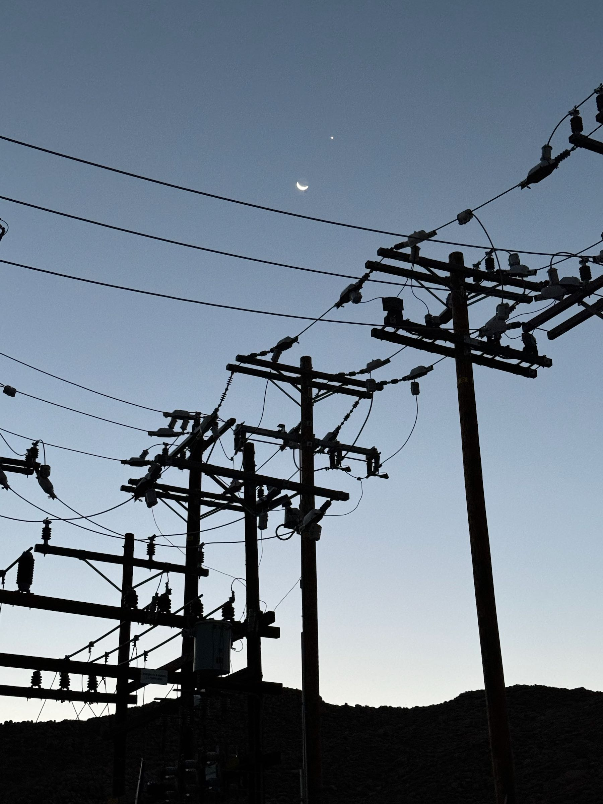

## Ancient Astronomy &mdash; Daily Schedule Term 3

Course [home page](./)

See also: [Daily Schedule Term 2](./daily_schedule-term_2.html)

### Week 8 &mdash; Continue Solar Theory

* Preparation for Thursday, Oct. 26 &mdash; Read Evans Sections 5.5 to 5.8, pp. 221-235 &mdash; As Assignment 8 for Thursday, do Parts 2, 3, and 4 of Evans Exercise 5.8, p. 235 using your birthday in 2023 for the last part
* Thursday, Oct. 26 &mdash; We did course evals &mdash; I was scribe and I will write up what was on the board &mdash; I presented Evans Exercise 5.6 on [Solar Eccentricity](./resources/SolarEccentricity.pdf) &mdash; We got Hipparchus's results for *e* and *A* to within 1 in the last decimal place &mdash; Walker presented Part 1 of Evans Exercise 5.8 and we found the mistake he had been searching for, and was valuable for everybody

### Week 9 &mdash; Finish Solar Theory &mdash;  Start the Fixed Stars

* Preparation for Monday, Oct. 30 &mdash; Assignment 9 is the completed [Venus](./assignments/venus_plotting/VenusPlottingChart.pdf) and [Jupiter](./assignments/jupiter_plotting/JupiterPlottingChart.pdf) plotting projects &mdash; Finish reading Chapter 5 &mdash; For Monday's presentations we decided that everyone will do all of Evans Exercise 5.10 and in class we will share the presentation of parts of it
* Monday, Oct. 30 &mdash; We discussed the magnitude system (which is coming up in Chapter 6) &mdash; We cross-checked Pollux and Procyon star phases with Rania's values &mdash; We did Parts 1-5 of Exercise 5.10 &mdash; At the end of class, we quickly looked at how the Main Circle sundial corrects for Daylight Savings Time, our longitude being 2&deg; west of the standard Pacific Time meridian of 120&deg;, and the Equation of Time
* Preparation for Thursday, Nov. 2 &mdash; Study Evans 6.1 to 6.4 &mdash; Add the Pollux-vs-Procyon Star Phase diagrams to your Assignment 7 and turn it back in &mdash; ALSO, check your values for your star phases against mine before you hand Assignment 7 back in, and flag any that disagree with me by more than a week
* Thursday, Nov. 2 &mdash; Precession &mdash; Cause of precession &mdash; [Law of Sines](./resources/LawOfSines.pdf) and [Law of Cosines](./resources/LawOfCosines.pdf) &mdash; Parallax &mdash; The apparent vs. true position of the Moon &mdash; We finished by doing Evans Exercise 6.5 together and got 204&deg; as the longitude of Spica &mdash; SkySafari says it was 203&deg;31' in 1977 &mdash; We took some shortcuts to finish on time &mdash; I will re-do the calculation and write it up

### Week 10 Finish the Fixed Stars &mdash; Observing at the College Observatory &mdash; Start Planetary Theory

* Monday, Nov. 6 &mdash; Meet at the SUVs at 5am &mdash; We'll observe Jupiter, Venus, and the Moon with a 10&rdquo; telescope
* Wednesday, Nov. 8 &mdash; A second, totally optional, observing session &mdash; Meet Hexi on the front steps at 7:45pm &mdash; *Bring a headlamp, there will be no moonlight* &mdash; We'll be observing Saturn, and the Andromeda Galaxy, and maybe we will get a sharper view of Jupiter

#### Setting our pace for the remainder of the course

We have only one chapter to finish Weeks 11-15, but it is the longest!
To be more quantitative, we have 155 pages in 31 sections to cover in those eight classes.
Below I have estimated how we can spread the reading out (in parenthesis after each date)
to make sure that we get all the way to Kepler in the final class.
We will almost surely want to make adjustments as we go.

* Preparation for Thursday, Nov. 9 &mdash; Read Evans 6.6 through 7.6, p. 312 &mdash; I was aggressive on this first reading in Chapter 7 because we only have one reading this week, and it will make the remaining eight classes easier &mdash; To make this reading slightly more manageable, you can just skim 6.9 and 6.10 because the motion called &ldquo;trepidation&rdquo; was just a giant misunderstanding about how the data was recorded &mdash; Also to make this reading more manageable, we'll save Exercise 7.5 to do in class &mdash; Finally, there is no homework due this week
* Thursday, Nov. 9 &mdash; We augmented our Venus plots by computing the ecliptic longitude of Venus on Oct. 16 &mdash; We reviewed the terminology that Evans introduces with planetary theory &mdash;  I handed out an improved version of the Spica calculations we did in class on Nov. 2 &mdash; Finally, we did Exercise 7.5 (Jupiter's tropical and synodic period) together in class

### Week 11 &mdash; Planetary Theory

* Preparation for Monday, Nov. 13 &mdash; Read Evans through Babylonian System A, p. 328 &mdash; As Assignment 10, do Evans Ex. 7.8 p. 316
* Monday, Nov. 13 &mdash; Carried forward from Oct. 30: Mac and Brian will produce a handout on Exercise 5.10

#### All readings and assignments in parenthesis are tentative!!

* Thursday, Nov. 16 (through 7.13, p. 347, 7.11 p. 334 or 7.14 p. 337 in class)

### Week 12

* Monday, Nov. 20 (through 7.18, p. 362, 7.16 Ptolemaic slats as Assignment 11 and 7.18 in class)
* Thursday, Nov. 23 &mdash; No class Thanksgiving holiday

### Week 13

* Monday, Nov. 27 (through 7.24, p. 384, another kind of big reading, but we have a whole week between classes, 7.22 as Assignment 12 and 7.24 in class)
* Thursday, Nov. 30 (through 7.26, p. 403)

### Week 14 &mdash; Copernicus

* Monday, Dec. 4 (through 7.29, p. 414)
* Thursday, Dec. 7 (through 7.30, p. 427)

### Week 15 &mdash; Final &mdash; Kepler

* Monday, Dec. 11 &mdash; [Final](./exams/Term2Exam.pdf)
* Thursday, Dec. 14 (through 7.31, p. 443)

<!--  -->

<!--  -->

<!-- https://www.youtube.com/watch?v=EpSy0Lkm3zM -->
