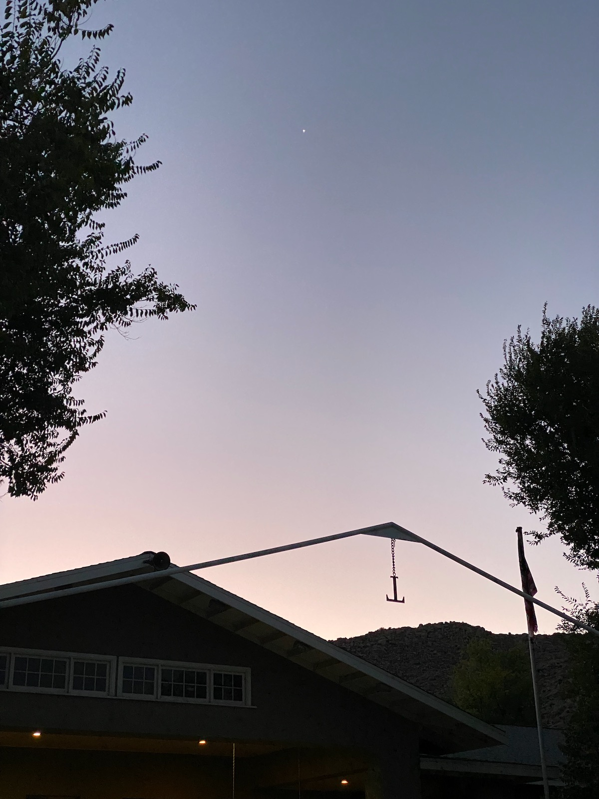

## Ancient Astronomy &mdash; Daily Schedule Term 3

Course [home page](./)

See also: [Daily Schedule Term 2](./daily_schedule-term_2.html)

### Week 8 &mdash; Continue Solar Theory

* Our class has its first Term 3 day on Thursday, Oct. 26 &mdash; Read Evans Sections 5.5 to 5.8, pp. 221-235 &mdash; As Assignment 8 for Thursday, do Evans Exercise 5.8, p. 235

### Week 9 &mdash; Finish Solar Theory &mdash; Start the Fixed Stars

* Preparation for Monday, Oct. 30 &mdash; Prepare to compare notes on the prior 30 days of [Jupiter plotting](./assignments/jupiter_plotting/JupiterPlottingChart.pdf) and [Venus plotting](./assignments/venus_plotting/VenusPlottingChart.pdf) from Sept. 29 to Oct. 29 &mdash; We could turn them in now, or we could continue the plotting for two more weeks and turn them during the week beginning Monday Nov. 13 &mdash; If we are to continue plotting Venus, we will need a new chart, because Venus will be leaving Leo and moving into Virgo &mdash; Read Evans Sections 5.9 to 6.3, pp. 235-260
* Thursday, Nov. 2 &mdash;

