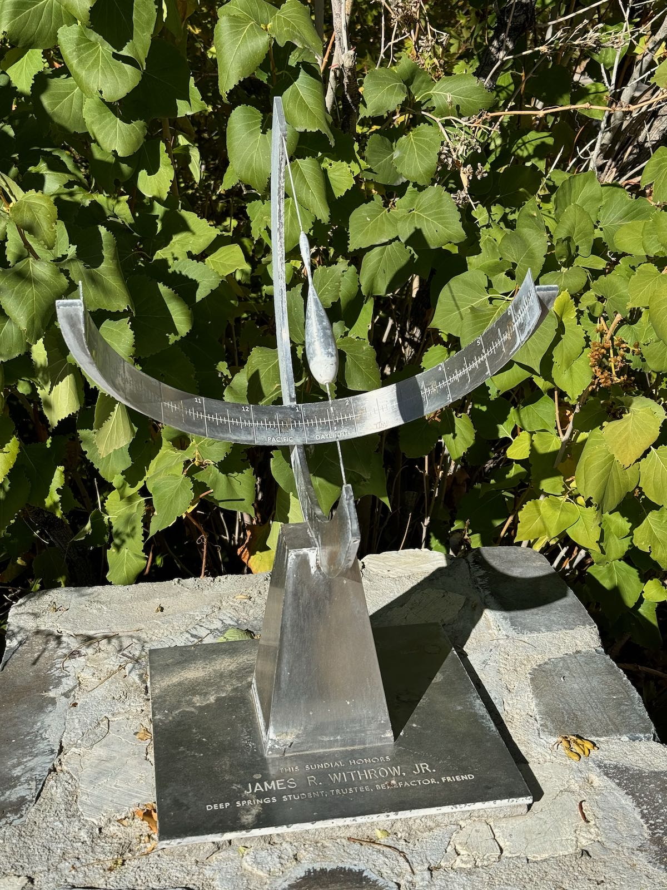
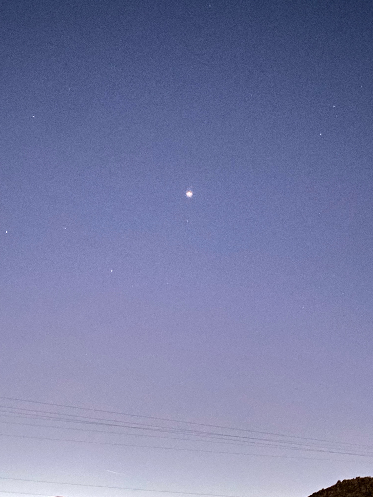

## Ancient Astronomy &mdash; Daily Schedule Term 3

Course [home page](./)

See also: [Daily Schedule Term 2](./daily_schedule-term_2.html)

### Week 8 &mdash; Continue Solar Theory

* Preparation for Thursday, Oct. 26 &mdash; Read Evans Sections 5.5 to 5.8, pp. 221-235 &mdash; As Assignment 8 for Thursday, do Parts 2, 3, and 4 of Evans Exercise 5.8, p. 235 using your birthday in 2023 for the last part
* Thursday, Oct. 26 &mdash; We did course evals &mdash; I was scribe and I will write up what was on the board &mdash; I presented Evans Exercise 5.6 on [Solar Eccentricity](./resources/SolarEccentricity.pdf) &mdash; We got Hipparchus's results for *e* and *A* to within 1 in the last decimal place &mdash; Walker presented Part 1 of Evans Exercise 5.8 and we found the mistake he had been searching for, and was valuable for everybody

### Week 9 &mdash; Finish Solar Theory &mdash; Start the Fixed Stars

* Preparation for Monday, Oct. 30 &mdash; Assignment 9 is the completed [Venus](./assignments/venus_plotting/VenusPlottingChart.pdf) and [Jupiter](./assignments/jupiter_plotting/JupiterPlottingChart.pdf) plotting projects &mdash; Finish reading Chapter 5 &mdash; For Monday's presentations we decided that everyone will do all of Evans Exercise 5.10 and in class we will share the presentation of parts of it
* Monday, Oct. 30 &mdash; We discussed the magnitude system (which is coming up in Chapter 6) &mdash; We cross-checked Pollux and Procyon star phases with Rania's values &mdash; We did Parts 1-5 of Exercise 5.10 &mdash; At the end of class, we quickly looked at how the Main Circle sundial corrects for Daylight Savings Time, our longitude being 2&deg; west of the standard Pacific Time meridian of 120&deg;, and the Equation of Time
* Preparation for Thursday, Nov. 2 &mdash; Study Evans 6.1 to 6.4 &mdash; Add the Pollux-vs-Procyon Star Phase diagrams to your Assignment 7 and turn it back in &mdash; ALSO, check your values for your star phases against mine before you hand Assignment 7 back in, and flag any that disagree with me by more than a week
* Thursday, Nov. 2 &mdash; Mac will present Part 6 of Exercise 5.10 &mdash; We will do Evans Exercise 6.5 in class &mdash; You do not have to prepare 6.5!

<!-- ### Week 10 &mdash; * Preparation for Monday, Nov. 6 &mdash; Study Evans 6.6 to 6.8 (to p. 274) -->

#### 2:52pm on Oct. 30

<!--  -->

<!-- https://www.youtube.com/watch?v=EpSy0Lkm3zM -->
